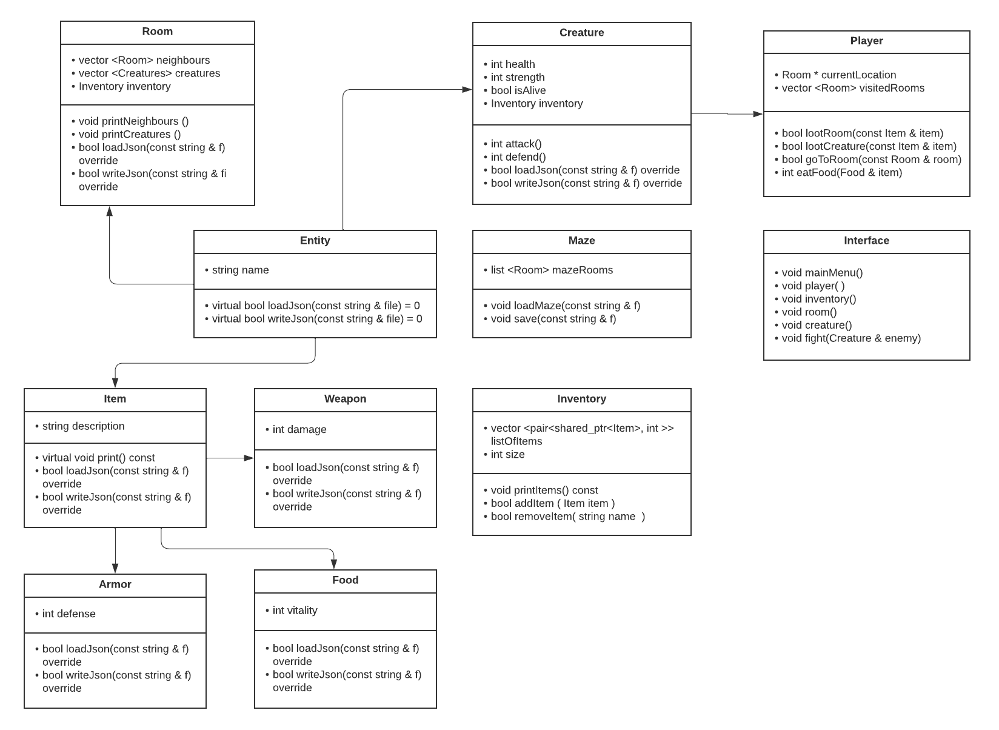

Author: Kristina Sinkovskaya

Task: Text choice-based RPG (gamebook like)

Description: 
Player explores a network of rooms while fighting monsters and gathering loot.
Every room is connected to other rooms as neighbours, and can contain weapons, 
armor, food, items, as well as some creatures. 
Creatures can be fought, killed and looted. 

Every creature (including the player) has its properties like health and strength. 
Strength is the default hit rate and can be increased by added weapons. 
Health is the vitality rate and can be decreased in a fight.

Before starting the game the configuration has to be set, including armors, weapons, food,
items, creatures, rooms and player. Weapons, armors, food and other items exist on the game level and
can be added by their name to player, locations and creatures to the possessed inventory.
Thus the player, locations, creatures can have items, weapons, armors and food.

The project will use external JSON library (https://github.com/nlohmann/json) for config upload. 
The game runs in the command line. 
Progress can be saved to json config files. When saving it saves the current status of 
the player and rooms; for loading the game it needs all file configs (armors, creatures, food, items,
player, rooms, weapons).

Polymorphism in the game: 
Inventory is a polymorphic container that holds items (weapons, armors, food, other items).
Inventory can be examined by `printItems` method, also polymorphic item can be added or removed 
with `addItem` and `removeItem`.
Player can loot rooms or (dead) creatures and pick up different polymorphic items with 
methods `lootRoom` or `lootCreature`. 
 
